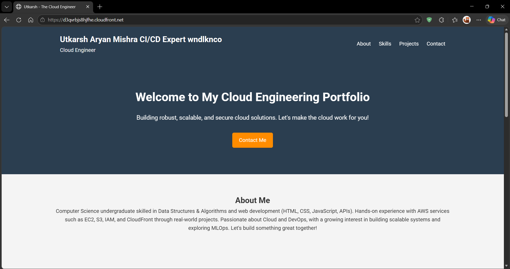

# 🌐 Cloud-Based Portfolio with CI/CD

This project demonstrates the deployment of a static portfolio website using AWS and automation through a CI/CD pipeline.

## 🚀 Live Website
https://d3qvrbjs8hjfhe.cloudfront.net/

---

## 🧱 Architecture

GitHub → GitHub Actions → AWS S3 → CloudFront (CDN + HTTPS)

---

## 🛠️ Tech Stack

- AWS S3 (Static Website Hosting)
- AWS CloudFront (CDN + HTTPS)
- AWS IAM (Access Management)
- GitHub Actions (CI/CD Automation)
- HTML, CSS, JavaScript

---

## ⚙️ Features

- Static website hosting on AWS S3
- Global content delivery using CloudFront
- HTTPS enabled via CloudFront
- Automated deployment using GitHub Actions
- Automatic cache invalidation

---

## 🔄 CI/CD Workflow

- Push code to GitHub
- GitHub Actions triggers deployment
- Files are synced to S3
- CloudFront cache is invalidated
- Updated site is live instantly

---

## 📸 Screenshots

### 🌐 Website

### ⚙️ CI/CD Pipeline

---

## 📌 Key Learnings

- AWS S3 static hosting
- CloudFront CDN and caching
- CI/CD pipeline setup
- GitHub Actions automation
- Handling real-world issues like secret management

---

## 📬 Connect with Me

LinkedIn: https://www.linkedin.com/in/utkarsh090205